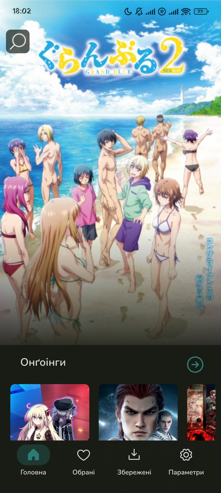
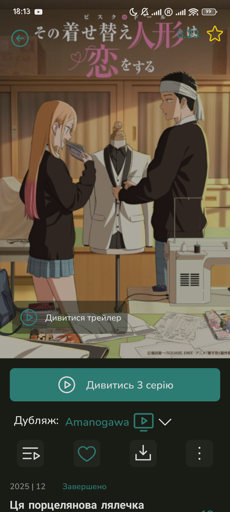
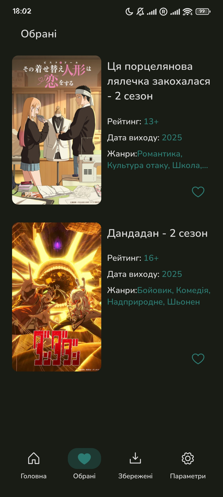
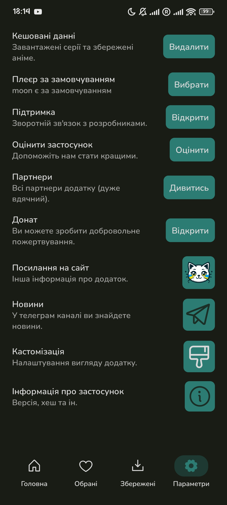

# AniUA - Аніме українською 🇺🇦

[English](README.md) | Українська версія

**AniUA** — це мобільний застосунок для Android, створений на React Native (Expo), який дозволяє переглядати та завантажувати аніме з українським дубляжем.

## Скріншоти

| Головний екран | Прев'ю аніме |
|----------------|--------------|
|  |  |

| Улюблені аніме | Налаштування |
|----------------|--------------|
|  |  |

## Функціонал

- 📺 Перегляд аніме з українським дубляжем
- 💾 Завантаження епізодів для офлайн перегляду
- ❤️ Список улюблених аніме
- 🔍 Пошук аніме за назвою
- 🎨 Кастомізація інтерфейсу
- 📱 Підтримка PiP (Picture-in-Picture)
- 🌙 Темна тема

## Джерела даних

- **Hikka API** — метадані про аніме, жанри, інформація про епізоди
- **Moon** — постачальник відео
- **Ashdi** — альтернативний постачальник відео

## Технології

- React Native (Expo)
- React Navigation
- MMKV для зберігання даних
- expo-video для відтворення відео
- FFmpeg для обробки відео
- Supabase для бекенду

## Розробка

### Встановлення залежностей

```bash
npm install
```

### Запуск на Android

```bash
npm start
npm run android
```

### Збірка

```bash
# APK для alpha каналу
npx eas build --profile alpha

# App Bundle для alpha каналу
npx eas build --profile aab-alpha

# OTA оновлення
npm run update-alpha
```

### Налаштування середовища

Створіть файл `.env.local` з наступними змінними:

```env
EXPO_PUBLIC_SUPABASE_URL=your_supabase_url
EXPO_PUBLIC_SUPABASE_KEY=your_supabase_key
EXPO_PUBLIC_MOON_KEY=your_moon_key
APP_URI=aniua://
```

## Структура проєкту

```plaintext
src/
├── Screens/          # Екрани застосунку
├── Widgets/          # Переиспользуемі компоненти UI
├── Sources/          # API інтеграції (Hikka, Moon, Ashdi)
├── Storage/          # Класи для роботи з MMKV
├── Global/           # Глобальні контексти та хуки
├── cfgs/             # Конфігурація (MainConfig)
└── Notifications/    # Система завантажень та нотифікацій
```

## Внесок у проєкт

Ми вітаємо ваш внесок! Ви можете:

- 🐛 Повідомляти про баги через [Issues](../../issues)
- 💡 Пропонувати нові функції
- 🔧 Створювати Pull Requests з покращеннями коду

**Важливо:** Згідно з ліцензією проєкту, форки (forks) не дозволені. Будь ласка, створюйте Pull Requests безпосередньо до основного репозиторію.

## Ліцензія

Цей проєкт має обмежену ліцензію. Детальніше див. [LICENSE](LICENSE).

**Короткий виклад:**

- ✅ Можна: покращувати, повідомляти про баги, ділитися посиланнями
- ❌ Не можна: створювати форки, комерційне використання без дозволу

## Посилання

- 🌐 Офіційний сайт: <https://aniua.yuzka.site>
- 📱 Deep link: `aniua://`

## Подяки

Дякуємо всім, хто підтримує український дубляж аніме! 🇺🇦

---

Зроблено з ❤️ для української аніме-спільноти
