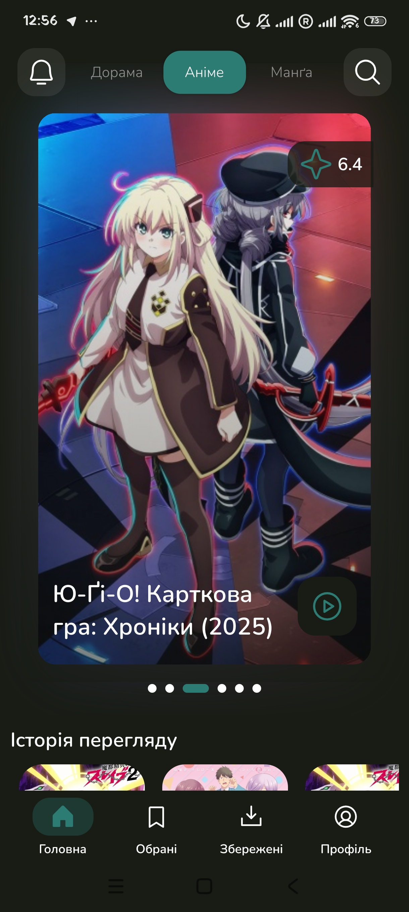
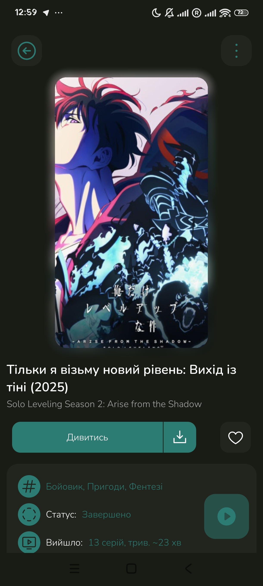
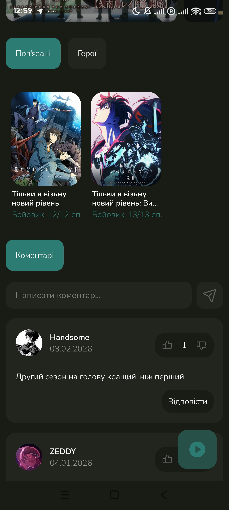
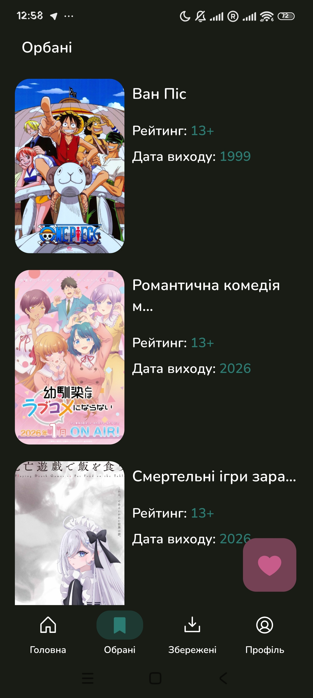
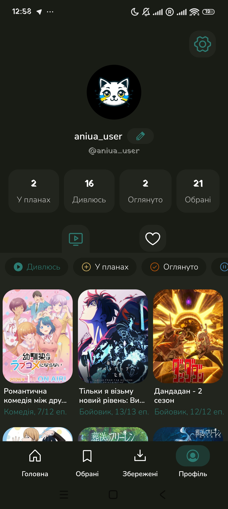
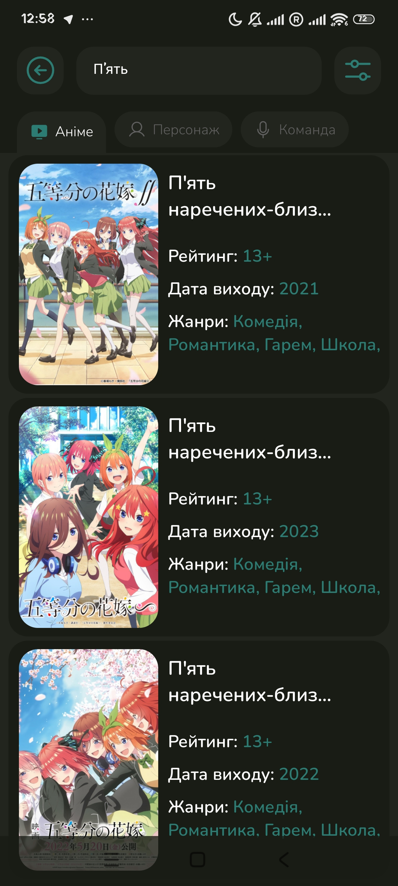
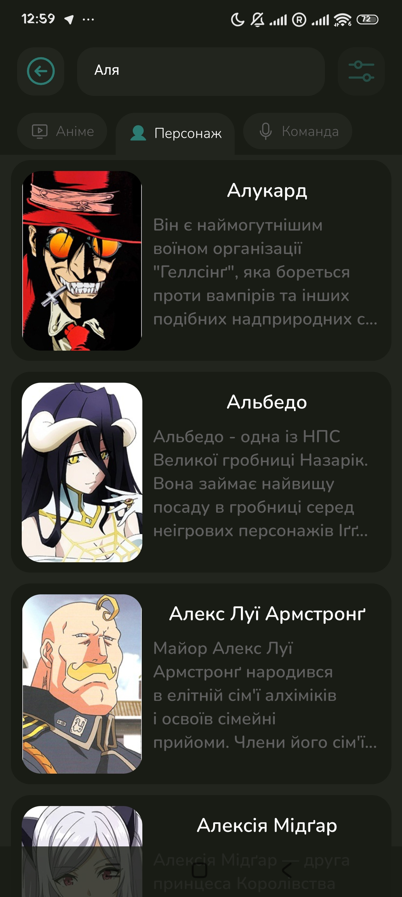
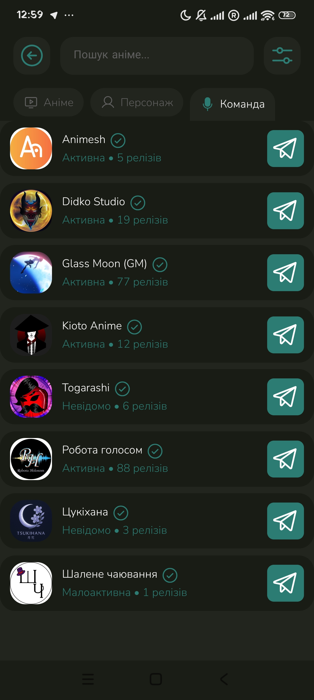
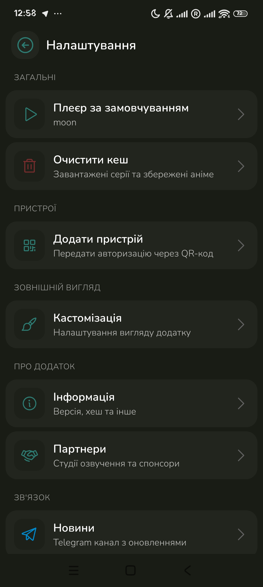

# AniUA — Аніме українською 🇺🇦

[English](README.md) | Українська версія

**AniUA** — Android застосунок на React Native (Expo) для перегляду та завантаження аніме з українським дубляжем.

<p align="center">
  
  
  
  
  
</p>

<p align="center">
  
  
  
  
</p>

---

## Що нового

- Покращений інтерфейс користувача
- Повідомлення про вихід нових серій
- Акаунт
- Закладки
- Покращений пошук — за назвою, персонажем, студією дубляжу
- Покращений екран інформації про аніме
- Синхронізація між пристроями
- Повноцінна підтримка Android TV та планшетів
- Зменшена вага APK

---

## Функціонал

- Перегляд аніме з українським дубляжем
- Завантаження епізодів для офлайн перегляду
- Закладки та улюблені
- Акаунт із синхронізацією між пристроями
- Пошук за назвою, персонажем та студією дубляжу
- Екран інформації про аніме з повними деталями
- Повідомлення про вихід нових серій
- Кастомізація інтерфейсу
- Підтримка PiP (Picture-in-Picture)
- Повна підтримка Android TV та планшетів

## Джерела даних

- **AniUA API** — основний провайдер серій, студії дубляжу, авторизація, push-сповіщення
- **Hikka API** — метадані про аніме, жанри, інформація про епізоди
- **Moon** — постачальник відео (запасний)
- **Ashdi** — постачальник відео (запасний)

## Технології

- React Native (Expo)
- React Navigation
- MMKV для локального сховища
- expo-video для відтворення відео
- FFmpeg для обробки відео
- Supabase для бекенду
- Notifee для сповіщень

---

## Розробка

### Встановлення залежностей

```bash
npm install
```

### Запуск на Android

```bash
npm start
npm run android
```

### Збірка

```bash
# Локальна збірка APK (release)
npm run build-release

# OTA оновлення
npm run update-release
```

### Налаштування середовища

Створіть файл `.env.local`:

```env
EXPO_PUBLIC_SUPABASE_URL=your_supabase_url
EXPO_PUBLIC_SUPABASE_KEY=your_supabase_key
EXPO_PUBLIC_MOON_KEY=your_moon_key
APP_URI=aniua://
EXPO_PUBLIC_HIKKA_CLIENT_ID=your_hikka_client_id
HIKKA_CLIENT_SECRET=your_hikka_secret
```

## Структура проєкту

```
src/
├── Screens/        # Екрани застосунку
├── Widgets/        # Компоненти UI
├── Sources/        # API інтеграції (Hikka, Moon, Ashdi)
├── Storage/        # Класи для роботи з MMKV
├── Global/         # Глобальні контексти та хуки
├── cfgs/           # Конфігурація (MainConfig)
├── Api/            # AniUA backend API
├── Notifications/  # Система завантажень та сповіщень
└── Services/       # Сервіс оновлень та інші сервіси
```

---

## Посилання

- Сайт: <https://aniua.app>
- Deep link: `aniua://`

## Ліцензія

Обмежена ліцензія. Детальніше — [LICENSE](LICENSE).

- Можна: покращувати, повідомляти про баги, ділитися посиланнями
- Не можна: форки, комерційне використання без дозволу

---

Зроблено з любов'ю для української аніме-спільноти 🇺🇦
